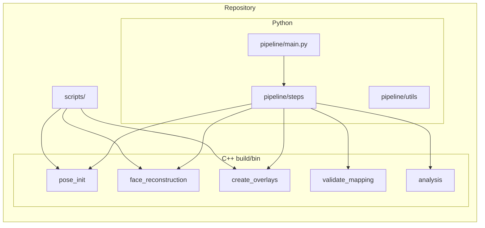
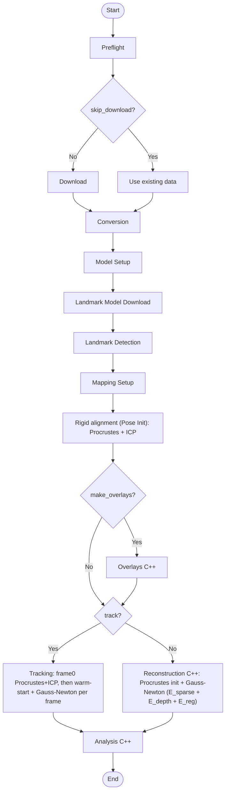
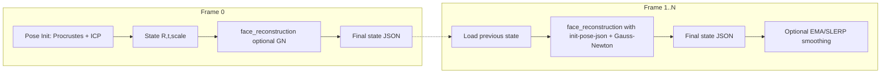
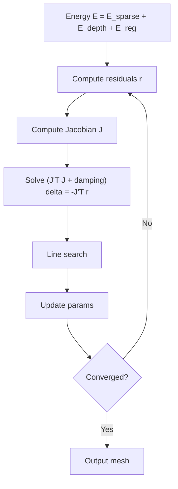

# Depth-Based Parametric Face Reconstruction from RGB-D Data

3D face reconstruction pipeline for the Biwi Kinect Head Pose dataset. Uses a parametric morphable model (identity + expression), rigid alignment (Procrustes + ICP), and Gauss-Newton optimization with sparse landmark and dense depth terms. Developed for TUM 3D Scanning & Motion Capture.

**Repository:** [https://github.com/ArdaSenyurek/Face-Reconstruction-TUM-3D-Scanning](https://github.com/ArdaSenyurek/Face-Reconstruction-TUM-3D-Scanning)

---

## Pipeline design and implementation

- **Design goals:** Single entrypoint (`pipeline/main.py`), config-driven run, optional steps (download, convert, model setup, pose init, reconstruct, analysis), and clear data flow aligned with the course project (depth-based parametric reconstruction, identity + expression, evaluation).
- **Why Python + C++:** Python handles orchestration, I/O, dataset discovery, and CLI; C++ handles numeric-heavy work (Procrustes, morphable model, Gauss-Newton, depth rendering, RMSE). Pipeline steps call C++ binaries via `subprocess` with paths and flags.
- **Modular steps:** Each step is a class (e.g. `DownloadStep`, `ConversionStep`, `PoseInitStep`, `ReconstructionStep`, `TrackingStep`) with `name`, `description`, and `execute()`. The orchestrator runs them in a fixed order with shared `config` and `state`; steps can be skipped via CLI (e.g. `--skip-convert`) or when prerequisites are missing.
- **Data flow:** Raw data → `converted/` (RGB, depth, intrinsics) → `landmarks/` (dlib) → **Pose Init (Procrustes + ICP)** → `pose_init/` → `meshes/` (C++ `face_reconstruction`) or tracking outputs; overlay and analysis steps consume these. Conversion reports drive all downstream steps.
- **Why this structure:** Enables partial runs, restart from a step, and reuse of the same C++ tools from scripts (e.g. evaluation) with consistent paths and options.

---

## How we use this codebase for the project

The project is described in the course proposal ([LaTeXAuthor_Guidelines_for_Proceedings.pdf](LaTeXAuthor_Guidelines_for_Proceedings.pdf)). Mapping from proposal to codebase:

| Proposal section | Implementation |
|------------------|----------------|
| **Technical approach (Section 2):** Parametric model M(α,δ), camera/depth rendering, energy E_sparse + E_depth + E_reg, optimization (Procrustes → Gauss-Newton) | C++ `include/` + `src/`: `MorphableModel`, `DepthRenderer`, `EnergyFunction`, `GaussNewton`, `Procrustes`, `LandmarkMapping`; exposed via `pose_init` and `face_reconstruction` binaries. |
| **Outputs (Section 2.5):** Identity mesh, per-frame expression/pose, depth renderings and overlays, quantitative error plots | Pipeline outputs under `meshes/`, `pose_init/`, tracking state JSON; `create_overlays`; `analysis` binary; `scripts/compute_metrics.py`, `aggregate_summary.py`. |
| **Evaluation (Section 4):** Depth error, landmark reprojection error, energy convergence, runtime | C++ `analysis` (RMSE, depth stats); `compute_metrics.py` (landmark/depth/surface metrics); pipeline runtime logging; qualitative overlays via `create_overlays` and `generate_visuals.py`. |
| **Milestones (Section 5):** Week 2–6 (model, landmarks, pose init, renderer, optimization, tracking, evaluation) | `ModelSetupStep`, `LandmarkDetectionStep`, `MappingSetupStep`, `PoseInitStep` + C++ `pose_init`; `DepthRenderer`, `EnergyFunction`; `face_reconstruction` with `--optimize`, `ReconstructionStep`, `Week4OverlayStep` (in `pipeline/steps/overlays.py`); `TrackingStep`; `run_eval.py`, `compute_metrics.py`, `aggregate_summary.py`, `generate_visuals.py`. |

---

## Architecture and flow diagrams

### General architecture



**Where C++ lives:** `src/tools/` (face_reconstruction, pose_init, create_overlays, validate_mapping, analysis), `src/alignment/` (Procrustes, ICP, LandmarkMapping), `src/model/`, `src/optimization/` (GaussNewton, EnergyFunction), `src/rendering/` (DepthRenderer), `src/camera/`, `src/landmarks/`, `src/utils/`. These are compiled into the binaries in `build/bin/` called by Python.

### Pipeline flow (step order; algorithm names)



- **Rigid alignment (Pose Init):** Explicit step; C++ `pose_init` runs **Procrustes** (similarity transform from landmark correspondences) then **ICP** refinement; outputs rigid-aligned mesh (PLY) and report JSON.
- **Reconstruction:** Single-frame; C++ `face_reconstruction` with optional **Gauss-Newton** (see optimization cycle below).
- **Tracking:** Frame 0 uses rigid alignment; frames 1..N use warm-start from previous frame’s state + Gauss-Newton; optional temporal smoothing (EMA/SLERP).

### Tracking flow (Frame 0 vs Frame 1..N)



### Gauss-Newton optimization (short)

When `--optimize` is used, Reconstruction (and Tracking) run a **Gauss-Newton** loop: compute residuals r (landmark + depth + reg) → compute Jacobian J → solve (J^T J + damping)·δ = −J^T r → line search → update parameters → convergence check. Energy: **E = E_sparse + E_depth + E_reg**.

### Full Gauss-Newton optimization cycle (appendix)



### Step → C++ binary → src/

| Pipeline step   | C++ binary         | Main src components |
|-----------------|--------------------|----------------------|
| Pose Init       | `pose_init`        | `src/tools/pose_init.cpp`, `src/alignment/Procrustes.cpp`, `LandmarkMapping.cpp`, `MorphableModel.cpp`, `ICP.cpp` |
| Reconstruction  | `face_reconstruction` | `src/tools/face_reconstruction.cpp`, `src/optimization/`, `src/rendering/`, `src/model/`, `src/alignment/` |
| Overlays        | `create_overlays`  | `src/tools/create_overlays.cpp`, `DepthRenderer`, `DepthUtils` |
| Mapping check   | `validate_mapping` | `src/tools/validate_mapping.cpp`, `MorphableModel`, `LandmarkMapping` |
| Analysis        | `analysis`         | `src/tools/analysis.cpp` |

---

## Entrypoints

### Main pipeline

| Entrypoint | Purpose | Main options |
|------------|---------|--------------|
| **pipeline/main.py** | End-to-end Biwi pipeline: download (optional), convert RGB-D, landmarks, BFM model setup, **Pose Init (Procrustes + ICP)**, reconstruction or tracking, optional overlays and Week 6 eval. | `--data-root`, `--output-root`, `--frames`, `--download`, `--skip-convert`, `--skip-pose-init`, `--skip-reconstruct`, `--no-analysis`, `--optimize`, `--track`, `--make-overlays`, `--week6-eval`, `--recon-binary`, `--pose-init-binary`, `--model-dir`, `--landmark-mapping` |

**Launch (from repo root):**
```bash
python pipeline/main.py [options]
```

**Example:**
```bash
python pipeline/main.py --download --frames 5
python pipeline/main.py --no-analysis --optimize --track
```

**Outputs:** Under `output_root`: `converted/`, `landmarks/`, `pose_init/`, `meshes/`, `analysis/`, `logs/`. With `--week6-eval`: `outputs/week6/`.

---

### C++ tools (build/bin/)

Built with CMake; called by the pipeline or scripts.

| Binary | Purpose | Main inputs | Outputs |
|--------|---------|-------------|---------|
| **face_reconstruction** | 3D mesh from RGB-D using PCA model + optional **Gauss-Newton** (E_sparse + E_depth + E_reg); supports tracking (init/state JSON). | `--rgb`, `--depth`, `--intrinsics`, `--model-dir`, `--landmarks`, `--mapping`, `--output-mesh`; `--optimize`, `--init-pose-json`, `--output-state-json` | PLY mesh; optional state JSON |
| **pose_init** | **Rigid alignment:** **Procrustes** + **ICP** from landmarks and depth. | `--rgb`, `--depth`, `--intrinsics`, `--landmarks`, `--model-dir`, `--mapping`, `--output`, `--report` | Aligned mesh (PLY); optional report JSON |
| **create_overlays** | Mesh-vs-scan overlays (rigid and optional optimized). | `--mesh-rigid`, `--depth`, `--intrinsics`, `--out-dir`; optional `--mesh-opt`, `--rgb`, `--output-metrics` | 3D overlay PLY, 2D PNG, depth comparison, metrics JSON |
| **validate_mapping** | Check landmark-to-model mapping against PCA model. | `--mapping`, `--model-dir`, optional `--min-count` | Exit code + console |
| **analysis** | 3D metrics (cloud-to-mesh RMSE, depth stats). | `--pointcloud`, `--mesh`; optional `--depth`, `--output-vis`, `--output-json` | JSON; optional PNG |

---

### Scripts (scripts/)

| Script | Purpose | Main options | Outputs |
|--------|---------|--------------|---------|
| **run_eval.py** | Three-stage evaluation: identity → expression → tracking. | `--data-root`, `--output-root`, `--sequences`, `--frames`, `--stage`, `--recon-binary`, `--pose-init-binary`, etc. | `outputs/week6/<seq>/<frame>/meshes/` (identity.ply, expression.ply, tracked.ply), metrics, visuals |
| **export_overlay_ply.py** | Export 3D overlay PLY for one seq/frame (rigid or opt). | `--seq`, `--stage` (rigid \| opt), `--frame`, `--output-root`, `--report` | Overlay PLY under week6 or reports/week6/figures |
| **generate_visuals.py** | 2D overlay (RGB + mesh) and depth comparison images. | `--seq`, `--frame`, `--mesh`, `--depth`, `--intrinsics`, `--output-dir` | overlay_rgb.png, depth_obs/rend/residual PNGs |
| **compute_metrics.py** | Per-frame metrics: 2D landmark, depth, 3D surface error. | `--mesh`, `--depth`, `--intrinsics`, `--landmarks`, `--mapping`, `--model-dir`, `--output`; optional `--pointcloud` | JSON |
| **aggregate_summary.py** | Aggregate week6 metrics into one CSV. | `--week6-dir` (default `outputs/week6`) | `outputs/week6/summary.csv` |
| **analyze_sparse_alignment.py** | Analyze pose_init JSON reports. | `--reports-dir`, `--output-dir` | Summary stats, plots, CSV |

---

### Pipeline utils (runnable as scripts)

| File | Purpose | Main usage |
|------|---------|------------|
| **pipeline/utils/convert_bfm_to_project.py** | Convert BFM (.mat/.h5) to project binary format. | BFM path + output model dir → mean_shape.bin, identity/expression basis, faces.bin |
| **pipeline/utils/create_bfm_landmark_mapping.py** | Build landmark mapping from BFM semantic indices. | `--bfm`, `--output` |
| **pipeline/utils/verify_bfm_semantic_mapping.py** | Verify BFM landmark mapping. | `--bfm`, mapping path |
| **pipeline/utils/triangulate_pointcloud.py** | Triangulate point cloud to mesh. | input PLY, output path |
| **pipeline/utils/center_mesh.py** | Center mesh at origin. | input/output mesh paths |
| **pipeline/utils/debug_alignment.py** | Debug alignment visualization. | `--seq`, paths |
| **pipeline/steps/overlays.py** | Generate overlays for sequences (e.g. 01, 17). | Run as module or via pipeline `--make-overlays` |

---

## Dependencies

### Python

- **File:** [requirements.txt](requirements.txt)  
  numpy, opencv-python, scipy, matplotlib, setuptools, wheel, dlib, kagglehub, h5py (and optional alternatives in comments).

**Install:**
```bash
pip install -r requirements.txt
```
Use Python 3.8+; a virtual environment is recommended (`python -m venv .venv` then activate).

### C++ (for pipeline tools)

- **CMake** 3.15+, **C++17** compiler, **Eigen3**, **OpenCV** (required for some tools).

**Build:**
```bash
mkdir build && cd build
cmake ..
cmake --build .
```
Executables appear in `build/bin/`.

**System packages (examples):**
- macOS: `brew install eigen opencv`
- Ubuntu: `sudo apt install libeigen3-dev libopencv-dev`

---

## Installation

1. Clone the repo and go to the project root.
2. Install Python deps: `pip install -r requirements.txt`
3. Build C++ tools: `mkdir build && cd build && cmake .. && cmake --build .`
4. (Optional) Obtain Biwi data: run with `--download` (requires Kaggle credentials) or place data under `data/` as expected by the pipeline.
5. (Optional) BFM model: place BFM file (.mat or .h5) in `data/bfm/` (see Large assets below).

---

## Large assets

Files larger than ~15 MB (e.g. BFM model) are **not** included in the repository or zip. Obtain the BFM (e.g. BFM 2017 or 2019 full head) from the official source or course resources and place it in `data/bfm/`. If you host such files on cloud storage (Google Drive, institutional host, etc.), add the link here for others to download.

---

## Example results

After a run (e.g. `python pipeline/main.py --frames 5 --optimize --track`), outputs under `outputs/` look like this:

**Directory layout**
- `converted/<seq>/` — RGB, depth, intrinsics, pointclouds per frame
- `landmarks/<seq>/` — detected 2D landmarks (TXT)
- `pose_init/<seq>/` — rigid-aligned meshes (`*_aligned.ply`) and `*_rigid_report.json`
- `meshes/<seq>/` — reconstructed meshes (`*_tracked.ply` or `*_optimized.ply`)
- `overlays_3d/<seq>/` — overlay PLYs and `*_overlay_metrics.json`
- `analysis/` — `metrics.json`, `tracking_summary_<seq>.json`, depth visualizations
- `logs/` — pipeline log and summary JSON

**Analysis metrics** (`outputs/analysis/metrics.json`) — one frame example:
```json
"01": {
  "frame_00000": {
    "cloud_points": 56336.0,
    "depth_min": 0.782, "depth_max": 0.997, "depth_mean": 0.87,
    "rmse_cloud_mesh_m": 0.152,
    "runtime_seconds": 0.40
  }
}
```
`rmse_cloud_mesh_m` is pointcloud-to-mesh RMSE in meters (~152 mm here).

**Rigid alignment** (`outputs/pose_init/<seq>/<frame>_rigid_report.json`) — example snippet:
```json
"mapping_quality": { "pre_alignment_rmse_mm": 800.1 },
"procrustes_analysis": {
  "post_procrustes_rmse_mm": 14.94,
  "post_icp_rmse_mm": 15.13,
  "improvement_percent": 98.1
},
"alignment_errors": { "rmse_mm": 15.13 }
```
So rigid alignment reduces landmark error from ~800 mm to ~15 mm after Procrustes + ICP.

**Rigid vs optimized** (`outputs/overlays_3d/<seq>/<frame>_overlay_metrics.json`) — example:
```json
"rigid":     { "nn_rmse_m": 0.1548 },
"optimized": { "nn_rmse_m": 0.1374 }
```
Nearest-neighbor mesh–scan RMSE in meters. Improvement = (0.1548 − 0.1374) × 1000 ≈ **17.4 mm** from optimization.

**Tracking summary** (`outputs/analysis/tracking_summary_<seq>.json`) — one frame:
```json
{
  "frame_idx": 0, "frame_name": "frame_00000",
  "translation_x": 0.060, "translation_y": 0.152, "translation_z": 1.182,
  "rotation_angle_deg": 170.6, "scale": 0.00105, "expression_norm": 3.0,
  "was_reinit": true, "optimization_converged": true
}
```
Use `translation_*`, `rotation_angle_deg`, `scale`, `expression_norm` for per-frame pose/expression. In tracking mode the pipeline optimizes both pose and expression each frame (warm-start from the previous frame), so these values can change over time when the subject moves. For the meaning of `face_nn_rmse_mm` and `final_energy`, see the note below.

---

## Outputs that demonstrate the project (proposal → deliverables)

The course proposal ([LaTeXAuthor_Guidelines_for_Proceedings.pdf](LaTeXAuthor_Guidelines_for_Proceedings.pdf)) defines **Section 2.5 Outputs** and **Section 4 Evaluation**. We implemented the full pipeline and produce all proposed outputs and metrics; below is where each deliverable lives in `outputs/` and what we achieved.

### Proposed outputs (Section 2.5)

| Proposed | Where it is | Files to show |
|----------|-------------|----------------|
| **Identity mesh** | Reconstructed identity (mean + α) from first/neutral frame | `meshes/<seq>/<frame>_optimized.ply` or `meshes/<seq>/<frame>_tracked.ply`; for Week 6 eval: `outputs/week6/<seq>/<frame>/meshes/identity.ply` |
| **Per-frame expression and pose** | Tracked parameters per frame | `analysis/tracking_summary_<seq>.json` (and `.csv`); `tracking/state/<seq>/<frame>_final.json` (R, t, scale, expression, identity) |
| **Depth renderings and overlays** | D_rend vs D_obs and mesh–scan overlays | `analysis/depth_vis/<seq>/*.png` (depth colormaps); `analysis/depth_residual_vis/<seq>/*_residual.png` (D_obs vs D_rend); `overlays_3d/<seq>/*_overlay_rigid.ply`, `*_overlay_opt.ply`; `overlays/<seq>/*.png` (2D overlays) |
| **Quantitative error plots** | Aggregated metrics and plots | `analysis/metrics.json`; pose_init `*_rigid_report.json`; `overlays_3d/<seq>/*_overlay_metrics.json`; run `scripts/analyze_sparse_alignment.py` and `scripts/compute_metrics.py` for summary stats and plots |

### Proposed evaluation (Section 4)

| Metric / evaluation | Where it is | What we achieved |
|--------------------|-------------|-------------------|
| **Depth reconstruction error** (RMSE_depth) | `analysis/metrics.json` (per-frame depth stats); `scripts/compute_metrics.py` (depth MAE/RMSE mm); overlay depth comparison | Per-frame depth min/max/mean and cloud–mesh RMSE; optional per-pixel depth error via compute_metrics |
| **Landmark reprojection error** (Err_lm) | `scripts/compute_metrics.py` (mean/median/RMSE in pixels); pose_init reports (3D alignment RMSE in mm) | 2D reprojection error from mesh landmarks vs detected landmarks; rigid alignment reports ~15 mm 3D landmark error after Procrustes+ICP |
| **Energy convergence** (E over iterations) | Week 6: `outputs/week6/<seq>/convergence.json` or per-frame `convergence.json` (from `face_reconstruction --output-convergence-json`) | `energy_history`, `step_norms`, `iterations`, `converged` for Gauss–Newton runs |
| **Runtime** | `analysis/metrics.json` → `runtime_seconds` per frame; pipeline log for total time | Per-frame reconstruction time (~0.4 s in examples); total pipeline time in logs |
| **Side-by-side D_obs vs D_rend** | `analysis/depth_residual_vis/<seq>/*_residual.png` | Visual comparison of observed vs rendered depth |
| **Mesh alignment from multiple viewpoints** | `overlays_3d/<seq>/*.ply` (scan + rigid/opt mesh); open in MeshLab | 3D overlay PLYs (cyan scan, red mesh) for qualitative check |
| **Temporal smoothness (reduced jitter)** | `analysis/tracking_summary_<seq>.json` (pose/expression per frame); `scripts/alignment_and_frame_metrics.py --tracking-summary` for frame-to-frame deltas | Per-frame pose and expression; optional temporal smoothing (EMA/SLERP) in pipeline |
| **Example outputs: identity + tracked expressions** | `meshes/<seq>/*_tracked.ply`; Week 6: `identity.ply`, `expression.ply`, `tracked.ply` | Reconstructed meshes per frame; Stage 1/2/3 meshes in week6 for evaluation protocol |

### Essential files to keep (for report or submission)

To show we delivered the proposal, keep at least:

- **Metrics and reports:** `outputs/analysis/metrics.json`, `outputs/analysis/tracking_summary_01.json` (and optionally `tracking_summary_17.json`), one or two `outputs/pose_init/<seq>/<frame>_rigid_report.json`, one or two `outputs/overlays_3d/<seq>/<frame>_overlay_metrics.json`.
- **Qualitative:** A few depth residual PNGs from `analysis/depth_residual_vis/<seq>/`, a few 3D overlay PLYs from `overlays_3d/<seq>/` (e.g. `*_overlay_rigid.ply`, `*_overlay_opt.ply`), and a few meshes from `meshes/<seq>/`.
- **Convergence (if using Week 6 eval):** `outputs/week6/<seq>/convergence.json` or per-frame `convergence.json`.
- **Pipeline run proof:** `outputs/logs/pipeline_summary.json` and one pipeline log from `outputs/logs/`.

### Creating a minimal bundle for upload (e.g. Google Drive)

To pack a **small copy** of `outputs/` with the same structure but only essential files (metrics, sample images, sample PLYs, logs):

```bash
python scripts/create_upload_bundle.py [--output-dir outputs_for_upload] [--inputs outputs] [--full-sequence 01]
```

This creates `outputs_for_upload/` (or the path you pass). **Rule:** sequence **01** gets **every frame**; all other sequences get **first frame only**. Contents: analysis metrics and tracking summaries, depth residual/vis PNGs, rigid reports and aligned meshes, reconstructed meshes, overlay metrics and overlay PLYs (all frames for 01, first only for others), tracking state JSON, and pipeline logs. Omitted for size: pointclouds, runtime_meshes. You can then zip `outputs_for_upload` and upload it to a drive folder; a short `README.txt` inside describes the contents.

Heavy or redundant data (e.g. all pointclouds, all runtime_meshes, every frame’s PLY) can be omitted; the files above are enough to demonstrate identity mesh, per-frame pose/expression, depth and overlay visuals, and quantitative metrics (depth error, landmark error, convergence, runtime).

---

## Checking alignment quality and frame differences

**Rigid alignment (pose init)**  
- Per-frame reports: `outputs/pose_init/<seq>/<frame>_rigid_report.json` with `pre_alignment_rmse_mm`, `post_procrustes_rmse_mm`, `post_icp_rmse_mm`.  
- To aggregate and plot:  
  `python scripts/analyze_sparse_alignment.py --reports-dir outputs/pose_init --output-dir outputs/analysis`

**Rigid vs non-rigid (optimized)**  
- When overlays are generated with both rigid and optimized mesh, `create_overlays` writes `*_overlay_metrics.json` with `rigid.nn_rmse_m` and `optimized.nn_rmse_m` (nearest-neighbor mesh–scan RMSE in meters). The difference (rigid − optimized) in mm is the improvement from optimization.  
- To report these and the improvement:  
  `python scripts/alignment_and_frame_metrics.py --overlay-metrics-dir outputs/overlays_3d`

**Frame-to-frame differences**  
- Tracking summaries: `outputs/analysis/tracking_summary_<seq>.json` (and CSV) contain per-frame translation, rotation, scale, expression_norm.  
- To compute deltas between consecutive frames:  
  `python scripts/alignment_and_frame_metrics.py --tracking-summary outputs/analysis/tracking_summary_01.json`

**Note on tracking summary RMSE fields:**  
- **`face_nn_rmse_mm`** is filled from the C++ binary’s optimization **final energy** (sum of weighted squared residuals), not geometric mesh–scan RMSE in mm. Large values (e.g. 88xxx or 264000) are energy, not mm.  
- **`final_energy`** is the same value with a correct name; use it for convergence or relative quality.  
- **`landmark_rmse_mm`** is not computed in tracking (always 0). For landmark/alignment quality use **pose_init** reports (`post_icp_rmse_mm` in `outputs/pose_init/<seq>/<frame>_rigid_report.json`).  
- For **geometric mesh–scan quality** after tracking, use overlay metrics (`nn_rmse_m` in `*_overlay_metrics.json`) or run the analysis step and see `metrics.json` / `scripts/compute_metrics.py`.

---

## License

See [LICENSE](LICENSE).
