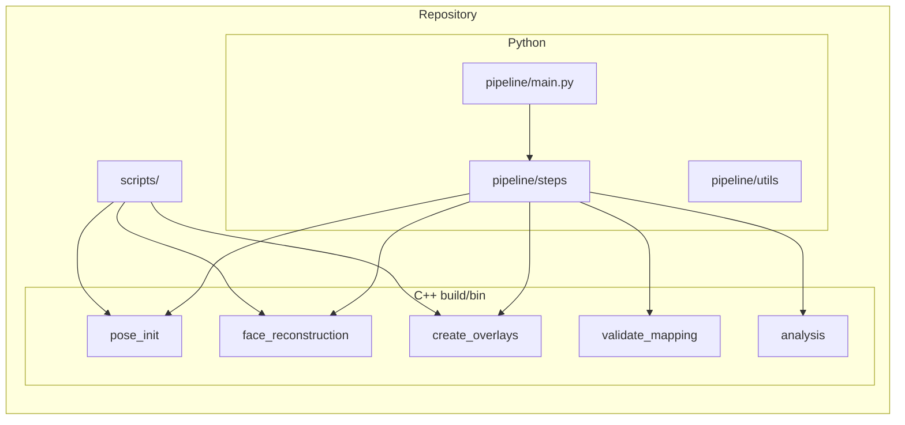
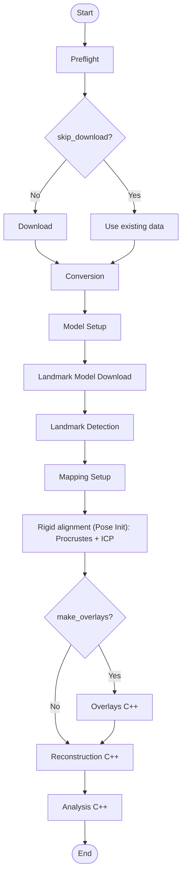
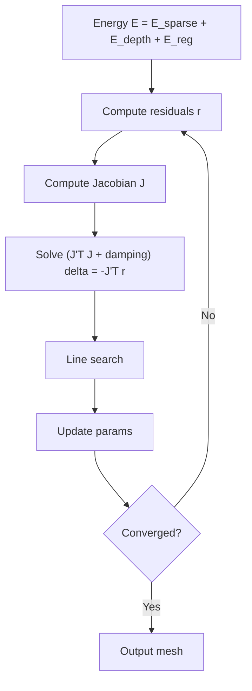

# Depth-Based Parametric Face Reconstruction from RGB-D Data

3D face reconstruction pipeline for the Biwi Kinect Head Pose dataset. Uses a parametric morphable model (identity + expression), rigid alignment (Procrustes + ICP), and Gauss-Newton optimization with sparse landmark and dense depth terms. Developed for TUM 3D Scanning & Motion Capture.

**Repository:** [https://github.com/ArdaSenyurek/Face-Reconstruction-TUM-3D-Scanning](https://github.com/ArdaSenyurek/Face-Reconstruction-TUM-3D-Scanning)

**Sample outputs and metrics:** [...]()

This README lists all **entrypoint files** (main pipeline, C++ tools, scripts, utils), **what each does and produces** (inputs, outputs, purpose), **dependencies and installation**, and **how to launch** the project; it does not document every internal function.

**Summary of accomplishments (key metrics):**
- **Rigid alignment (Procrustes + ICP):** Landmark alignment error reduced from ~800 mm (pre-alignment) to ~15 mm (post-ICP), ~98% improvement (see `pose_init/*_rigid_report.json`).
- **Optimization (Gauss-Newton):** Nearest-neighbor mesh–scan RMSE improvement of ~17 mm (rigid vs optimized) in typical runs (see `overlays_3d/*_overlay_metrics.json`).
- **Runtime:** ~0.4 s per frame for reconstruction; pipeline logs total time in `outputs/logs/`.
- **Deliverables:** Identity mesh, per-frame expression/pose, depth renderings and overlays, and quantitative metrics (depth error, landmark error, convergence, runtime) as in the proposal (Section 2.5 and 4).

---

## Pipeline design and implementation

- **Design goals:** Single entrypoint (`pipeline/main.py`), config-driven run, optional steps (download, convert, model setup, pose init, reconstruct, analysis), and clear data flow aligned with the course project (depth-based parametric reconstruction, identity + expression, evaluation).
- **Why Python + C++:** Python handles orchestration, I/O, dataset discovery, and CLI; C++ handles numeric-heavy work (Procrustes, morphable model, Gauss-Newton, depth rendering, RMSE). Pipeline steps call C++ binaries via `subprocess` with paths and flags.
- **Modular steps:** Each step is a class (e.g. `DownloadStep`, `ConversionStep`, `PoseInitStep`, `ReconstructionStep`) with `name`, `description`, and `execute()`. The orchestrator runs them in a fixed order with shared `config` and `state`; steps can be skipped via CLI (e.g. `--skip-convert`) or when prerequisites are missing.
- **Data flow:** Raw data → `converted/` (RGB, depth, intrinsics) → `landmarks/` (dlib) → **Pose Init (Procrustes + ICP)** → `pose_init/` → `meshes/` (C++ `face_reconstruction`); overlay and analysis steps consume these. Conversion reports drive all downstream steps.
- **Why this structure:** Enables partial runs, restart from a step, and reuse of the same C++ tools from scripts (e.g. evaluation) with consistent paths and options.

---

## How we use this codebase for the project

The proposal (Section 3) mentions RGB-D from Azure Kinect or RealSense; this implementation uses the **Biwi Kinect Head Pose dataset** instead. Mapping from proposal to codebase:

| Proposal section | Implementation |
|------------------|----------------|
| **Technical approach (Section 2):** Parametric model M(α,δ), camera/depth rendering, energy E_sparse + E_depth + E_reg, optimization (Procrustes → Gauss-Newton) | C++ `include/` + `src/`: `MorphableModel`, `DepthRenderer`, `EnergyFunction`, `GaussNewton`, `Procrustes`, `LandmarkMapping`; exposed via `pose_init` and `face_reconstruction` binaries. |
| **Outputs (Section 2.5):** Identity mesh, per-frame expression/pose, depth renderings and overlays, quantitative error plots | Pipeline outputs under `meshes/`, `pose_init/`; `create_overlays`; `analysis` binary; `scripts/compute_metrics.py`. |
| **Evaluation (Section 4):** Depth error, landmark reprojection error, energy convergence, runtime | C++ `analysis` (RMSE, depth stats); `compute_metrics.py` (landmark/depth/surface metrics); pipeline runtime logging; qualitative overlays via `create_overlays` and `generate_visuals.py`. |

---

## Architecture and flow diagrams

### General architecture



**Where C++ lives:** `src/tools/` (face_reconstruction, pose_init, create_overlays, validate_mapping, analysis), `src/alignment/` (Procrustes, ICP, LandmarkMapping), `src/model/`, `src/optimization/` (GaussNewton, EnergyFunction), `src/rendering/` (DepthRenderer), `src/camera/`, `src/landmarks/`, `src/utils/`. These are compiled into the binaries in `build/bin/` called by Python.

### Pipeline flow (step order; algorithm names)



- **Rigid alignment (Pose Init):** Explicit step; C++ `pose_init` runs **Procrustes** (similarity transform from landmark correspondences) then **ICP** refinement; outputs rigid-aligned mesh (PLY) and report JSON. The proposal listed PnP or Procrustes; we use Procrustes + ICP only.
- **Reconstruction:** Single-frame; C++ `face_reconstruction` with optional **Gauss-Newton** (see optimization cycle below).

### Gauss-Newton optimization (short)

When `--optimize` is used, Reconstruction runs a **Gauss-Newton** loop: compute residuals r (landmark + depth + reg) → compute Jacobian J → solve (J^T J + damping)·δ = −J^T r → line search → update parameters → convergence check. Energy: **E = E_sparse + E_depth + E_reg**.

### Full Gauss-Newton optimization cycle (appendix)



### Step → C++ binary → src/

| Pipeline step   | C++ binary         | Main src components |
|-----------------|--------------------|----------------------|
| Pose Init       | `pose_init`        | `src/tools/pose_init.cpp`, `src/alignment/Procrustes.cpp`, `LandmarkMapping.cpp`, `MorphableModel.cpp`, `ICP.cpp` |
| Reconstruction  | `face_reconstruction` | `src/tools/face_reconstruction.cpp`, `src/optimization/`, `src/rendering/`, `src/model/`, `src/alignment/` |
| Overlays        | `create_overlays`  | `src/tools/create_overlays.cpp`, `DepthRenderer`, `DepthUtils` |
| Mapping check   | `validate_mapping` | `src/tools/validate_mapping.cpp`, `MorphableModel`, `LandmarkMapping` |
| Analysis        | `analysis`         | `src/tools/analysis.cpp` |

---

## Entrypoints

### Main pipeline

| Entrypoint | Purpose | Main options |
|------------|---------|--------------|
| **pipeline/main.py** | End-to-end Biwi pipeline: download (optional), convert RGB-D, landmarks, BFM model setup, **Pose Init (Procrustes + ICP)**, reconstruction, optional overlays. | `--data-root`, `--output-root`, `--frames`, `--download`, `--skip-convert`, `--skip-pose-init`, `--skip-reconstruct`, `--no-analysis`, `--optimize`, `--make-overlays`, `--recon-binary`, `--pose-init-binary`, `--model-dir`, `--landmark-mapping` |

**Launch (from repo root):**
```bash
python pipeline/main.py [options]
```

**Example:**
```bash
python pipeline/main.py --download --frames 5
python pipeline/main.py --no-analysis --optimize
```

**Outputs:** Under `output_root`: `converted/`, `landmarks/`, `pose_init/`, `meshes/`, `analysis/`, `logs/`.

---

### C++ tools (build/bin/)

Built with CMake; called by the pipeline or scripts.

| Binary | Purpose | Main inputs | Outputs |
|--------|---------|-------------|---------|
| **face_reconstruction** | 3D mesh from RGB-D using PCA model + optional **Gauss-Newton** (E_sparse + E_depth + E_reg). | `--rgb`, `--depth`, `--intrinsics`, `--model-dir`, `--landmarks`, `--mapping`, `--output-mesh`; `--optimize` | PLY mesh |
| **pose_init** | **Rigid alignment:** **Procrustes** + **ICP** from landmarks and depth. | `--rgb`, `--depth`, `--intrinsics`, `--landmarks`, `--model-dir`, `--mapping`, `--output`, `--report` | Aligned mesh (PLY); optional report JSON |
| **create_overlays** | Mesh-vs-scan overlays (rigid and optional optimized). | `--mesh-rigid`, `--depth`, `--intrinsics`, `--out-dir`; optional `--mesh-opt`, `--rgb`, `--output-metrics` | 3D overlay PLY, 2D PNG, depth comparison, metrics JSON |
| **validate_mapping** | Check landmark-to-model mapping against PCA model. | `--mapping`, `--model-dir`, optional `--min-count` | Exit code + console |
| **analysis** | 3D metrics (cloud-to-mesh RMSE, depth stats). | `--pointcloud`, `--mesh`; optional `--depth`, `--output-vis`, `--output-json` | JSON; optional PNG |

---

### Scripts (scripts/)

| Script | Purpose | Main options | Outputs |
|--------|---------|--------------|---------|
| **generate_visuals.py** | 2D overlay (RGB + mesh) and depth comparison images. | `--seq`, `--frame`, `--mesh`, `--depth`, `--intrinsics`, `--output-dir` | overlay_rgb.png, depth_obs/rend/residual PNGs |
| **compute_metrics.py** | Per-frame metrics: 2D landmark, depth, 3D surface error. | `--mesh`, `--depth`, `--intrinsics`, `--landmarks`, `--mapping`, `--model-dir`, `--output`; optional `--pointcloud` | JSON |
| **analyze_sparse_alignment.py** | Analyze pose_init JSON reports. | `--reports-dir`, `--output-dir` | Summary stats, plots, CSV |
| **alignment_and_frame_metrics.py** | Overlay metrics (rigid vs optimized mesh–scan RMSE). | `--overlay-metrics-dir` | Summary stats, improvement in mm |
| **create_upload_bundle.py** | Pack a minimal subset of `outputs/` for upload (metrics, sample PNGs/PLYs, logs). | `--output-dir`, `--inputs`, `--full-sequence` | `outputs_for_upload/` (or given path) |

**Return values / exit codes:**
- **pipeline/main.py:** Exits **0** on success, **1** on failure, **130** on Ctrl+C. Success means all requested steps completed; a step failure causes exit 1.
- **Scripts above:** Exit **0** on success, **1** on error (e.g. missing input, invalid args). Use in scripts with `sys.exit(main())`.
- **C++ binaries (build/bin/):** Exit **0** on success, **1** on failure (missing file, invalid config, or runtime error). The pipeline checks these to decide step success.

---

### Pipeline utils (runnable as scripts)

| File | Purpose | Main usage |
|------|---------|------------|
| **pipeline/utils/convert_bfm_to_project.py** | Convert BFM (.mat/.h5) to project binary format. | BFM path + output model dir → mean_shape.bin, identity/expression basis, faces.bin |
| **pipeline/utils/create_bfm_landmark_mapping.py** | Build landmark mapping from BFM semantic indices. | `--bfm`, `--output` |
| **pipeline/utils/verify_bfm_semantic_mapping.py** | Verify BFM landmark mapping. | `--bfm`, mapping path |
| **pipeline/utils/triangulate_pointcloud.py** | Triangulate point cloud to mesh. | input PLY, output path |
| **pipeline/utils/center_mesh.py** | Center mesh at origin. | input/output mesh paths |
| **pipeline/utils/debug_alignment.py** | Debug alignment visualization. | `--seq`, paths |
| **pipeline/utils/create_pointcloud_from_rgbd.py** | Build point cloud from RGB-D (depth + intrinsics). | Used by conversion and analysis steps; callable with image paths and output PLY |
| **pipeline/utils/create_mean_shape_from_pointclouds.py** | Create mean shape from a set of point cloud PLYs. | Point cloud files + output dir; optional `--use-single` |
| **pipeline/steps/overlays.py** | Generate overlays for sequences (e.g. 01, 17). | Run as module or via pipeline `--make-overlays` |

---

## Dependencies

### Python

- **File:** [requirements.txt](requirements.txt)  
  numpy, opencv-python, scipy, matplotlib, setuptools, wheel, dlib, kagglehub, h5py (and optional alternatives in comments).

**Install:**
```bash
pip install -r requirements.txt
```
Use Python 3.8+; a virtual environment is recommended (`python -m venv .venv` then activate).

### C++ (for pipeline tools)

- **CMake** 3.15+, **C++17** compiler, **Eigen3**, **OpenCV** (required for some tools).

**Build:**
```bash
mkdir build && cd build
cmake ..
cmake --build .
```
Executables appear in `build/bin/`.

**System packages (examples):**
- macOS: `brew install eigen opencv`
- Ubuntu: `sudo apt install libeigen3-dev libopencv-dev`

---

## Installation

1. Clone the repo and go to the project root.
2. Install Python deps: `pip install -r requirements.txt`
3. **Build the C++ tools** (required for the pipeline):
   ```bash
   mkdir build && cd build
   cmake ..
   cmake --build .
   ```
   Executables will be in `build/bin/` (e.g. `face_reconstruction`, `pose_init`, `create_overlays`, `analysis`).
4.Obtain Biwi data: run with `--download` (requires Kaggle credentials) or place data under `data/` as expected by the pipeline.
5.**BFM face model:** download the BFM (see **Large assets** below), then place the file (`.mat` or `.h5`) in `data/bfm/`. The pipeline will convert it to the project format (model setup step) or you can run `pipeline/utils/convert_bfm_to_project.py` manually.

---

## How to run

From the **repository root**:

```bash
# Default run (uses existing data under data/; processes a few frames)
python pipeline/main.py

# Download Biwi data first, then run on 5 frames
python pipeline/main.py --download --frames 5

# Run with Gauss-Newton optimization, skip analysis
python pipeline/main.py --no-analysis --optimize
```

Outputs go under `outputs/` (or `--output-root` if set). See **Entrypoints → Main pipeline** for all options (`--skip-convert`, `--make-overlays`, etc.).

---

## Large assets

**Where to download the model:** The BFM (Basel Face Model, e.g. BFM 2017 or 2019 full head) is not included in the repo due to size. Download it from the **official BFM website** or from **course resources** (TUM 3D Scanning & Motion Capture). Place the downloaded file (`.mat` or `.h5`) in `data/bfm/`.

**How to use it:** The pipeline’s model setup step converts the BFM to the project binary format (mean shape, identity/expression bases, faces). You can also run `pipeline/utils/convert_bfm_to_project.py` manually.

---

## Example results

After a run (e.g. `python pipeline/main.py --frames 5 --optimize`), outputs under `outputs/` look like this:

**Directory layout**
- `converted/<seq>/` — RGB, depth, intrinsics, pointclouds per frame
- `landmarks/<seq>/` — detected 2D landmarks (TXT)
- `pose_init/<seq>/` — rigid-aligned meshes (`*_aligned.ply`) and `*_rigid_report.json`
- `meshes/<seq>/` — reconstructed meshes (`*_optimized.ply`)
- `overlays_3d/<seq>/` — overlay PLYs and `*_overlay_metrics.json`
- `analysis/` — `metrics.json`, depth visualizations
- `logs/` — pipeline log and summary JSON

**Analysis metrics** (`outputs/analysis/metrics.json`) — one frame example:
```json
"01": {
  "frame_00000": {
    "cloud_points": 56336.0,
    "depth_min": 0.782, "depth_max": 0.997, "depth_mean": 0.87,
    "rmse_cloud_mesh_m": 0.152,
    "runtime_seconds": 0.40
  }
}
```
All depth values (`depth_min`, `depth_max`, `depth_mean`, `depth_std`) and `rmse_cloud_mesh_m` are in **meters**. The fields `cloud_points` and `rmse_cloud_mesh_m` appear only when the analysis step is run with a pointcloud (e.g. when conversion produces pointclouds and they are passed to the analysis binary); otherwise only depth stats and `runtime_seconds` may be present.

**Rigid alignment** (`outputs/pose_init/<seq>/<frame>_rigid_report.json`) — example snippet:
```json
"mapping_quality": { "pre_alignment_rmse_mm": 800.1 },
"procrustes_analysis": {
  "post_procrustes_rmse_mm": 14.94,
  "post_icp_rmse_mm": 15.13,
  "improvement_percent": 98.1
},
"alignment_errors": { "rmse_mm": 15.13 }
```
So rigid alignment reduces landmark error from ~800 mm to ~15 mm after Procrustes + ICP.

**Rigid vs optimized** (`outputs/overlays_3d/<seq>/<frame>_overlay_metrics.json`) — example:
```json
"rigid":     { "nn_rmse_m": 0.1548 },
"optimized": { "nn_rmse_m": 0.1374 }
```
Nearest-neighbor mesh–scan RMSE in meters. Improvement = (0.1548 − 0.1374) × 1000 ≈ **17.4 mm** from optimization.


**Visualizations for the report (where to find figures):**
- **Depth: observed vs rendered:** `outputs/analysis/depth_residual_vis/<seq>/*_residual.png` — side-by-side or difference of D_obs and D_rend.
- **Depth colormaps:** `outputs/analysis/depth_vis/<seq>/*.png` — observed/rendered depth as images.
- **3D mesh–scan overlay:** `outputs/overlays_3d/<seq>/*_overlay_rigid.ply`, `*_overlay_opt.ply` — open in MeshLab/CloudCompare (cyan = scan, red = mesh).
- **2D overlay (RGB + mesh):** `outputs/overlays/<seq>/*_overlay.png` (landmarks); for mesh projection use `generate_visuals.py` → `overlay_rgb.png`, or `create_overlays` → `*_overlay_2d.png` in the overlay output dir.
- **Convergence (Gauss-Newton):** If `face_reconstruction` is run with convergence output, plot `energy_history` / `step_norms` vs iteration.
- **Pose-init / alignment quality:** Run `scripts/analyze_sparse_alignment.py` → summary stats and plots in the given `--output-dir`.

Include a few of these (e.g. one depth residual, one 3D overlay, one convergence plot) in the written report to show qualitative and quantitative results.

---

## Outputs that demonstrate the project (proposal → deliverables)

The course proposal ([LaTeXAuthor_Guidelines_for_Proceedings.pdf](LaTeXAuthor_Guidelines_for_Proceedings.pdf)) defines **Section 2.5 Outputs** and **Section 4 Evaluation**. We implemented the full pipeline and produce all proposed outputs and metrics; below is where each deliverable lives in `outputs/` and what we achieved.

### Proposed outputs (Section 2.5)

| Proposed | Where it is | Files to show |
|----------|-------------|----------------|
| **Identity mesh** | Reconstructed mesh (mean + α + expression) per frame | `meshes/<seq>/<frame>_optimized.ply` |
| **Per-frame expression and pose** | Parameters per frame (from reconstruction) | Reconstructed mesh and metrics in `analysis/metrics.json`; pose in pose_init reports |
| **Depth renderings and overlays** | D_rend vs D_obs and mesh–scan overlays | `analysis/depth_vis/<seq>/*.png` (depth colormaps); `analysis/depth_residual_vis/<seq>/*_residual.png` (D_obs vs D_rend); `overlays_3d/<seq>/*_overlay_rigid.ply`, `*_overlay_opt.ply`; `overlays/<seq>/*.png` (2D overlays) |
| **Quantitative error plots** | Aggregated metrics and plots | `analysis/metrics.json`; pose_init `*_rigid_report.json`; `overlays_3d/<seq>/*_overlay_metrics.json`; run `scripts/analyze_sparse_alignment.py` and `scripts/compute_metrics.py` for summary stats and plots |

### Proposed evaluation (Section 4)

| Metric / evaluation | Where it is | What we achieved |
|--------------------|-------------|-------------------|
| **Depth reconstruction error** (RMSE_depth) | `analysis/metrics.json` (per-frame depth stats); `scripts/compute_metrics.py` (depth MAE/RMSE mm); overlay depth comparison | Per-frame depth min/max/mean and cloud–mesh RMSE; optional per-pixel depth error via compute_metrics |
| **Landmark reprojection error** (Err_lm) | `scripts/compute_metrics.py` (mean/median/RMSE in pixels); pose_init reports (3D alignment RMSE in mm) | 2D reprojection error from mesh landmarks vs detected landmarks; rigid alignment reports ~15 mm 3D landmark error after Procrustes+ICP |
| **Energy convergence** (E over iterations) | From `face_reconstruction` if run with convergence output | `energy_history`, `step_norms`, `iterations`, `converged` for Gauss–Newton runs |
| **Runtime** | `analysis/metrics.json` → `runtime_seconds` per frame; pipeline log for total time | Per-frame reconstruction time (~0.4 s in examples); total pipeline time in logs |
| **Side-by-side D_obs vs D_rend** | `analysis/depth_residual_vis/<seq>/*_residual.png` | Visual comparison of observed vs rendered depth |
| **Mesh alignment from multiple viewpoints** | `overlays_3d/<seq>/*.ply` (scan + rigid/opt mesh); open in MeshLab | 3D overlay PLYs (cyan scan, red mesh) for qualitative check |
| **Example outputs: identity + expression** | `meshes/<seq>/*_optimized.ply` | Reconstructed meshes per frame |

### Essential files to keep (for report or submission)

To show we delivered the proposal, keep at least:

- **Metrics and reports:** `outputs/analysis/metrics.json`, one or two `outputs/pose_init/<seq>/<frame>_rigid_report.json`, one or two `outputs/overlays_3d/<seq>/<frame>_overlay_metrics.json`.
- **Qualitative:** A few depth residual PNGs from `analysis/depth_residual_vis/<seq>/`, a few 3D overlay PLYs from `overlays_3d/<seq>/` (e.g. `*_overlay_rigid.ply`, `*_overlay_opt.ply`), and a few meshes from `meshes/<seq>/`.
- **Pipeline run proof:** `outputs/logs/pipeline_summary.json` and one pipeline log from `outputs/logs/`.

### Creating a minimal bundle for upload (e.g. Google Drive)

To pack a **small copy** of `outputs/` with the same structure but only essential files (metrics, sample images, sample PLYs, logs):

```bash
python scripts/create_upload_bundle.py [--output-dir outputs_for_upload] [--inputs outputs] [--full-sequence 01]
```

This creates `outputs_for_upload/` (or the path you pass). **Rule:** sequence **01** gets **every frame**; all other sequences get **first frame only**. Contents: analysis metrics, depth residual/vis PNGs, rigid reports and aligned meshes, reconstructed meshes, overlay metrics and overlay PLYs, and pipeline logs. Omitted for size: pointclouds, runtime_meshes. You can then zip `outputs_for_upload` and upload it to a drive folder; a short `README.txt` inside describes the contents.

Heavy or redundant data (e.g. all pointclouds, all runtime_meshes, every frame’s PLY) can be omitted; the files above are enough to demonstrate identity mesh, per-frame pose/expression, depth and overlay visuals, and quantitative metrics (depth error, landmark error, convergence, runtime).

---

## Checking alignment quality and frame differences

**Rigid alignment (pose init)**  
- Per-frame reports: `outputs/pose_init/<seq>/<frame>_rigid_report.json` with `pre_alignment_rmse_mm`, `post_procrustes_rmse_mm`, `post_icp_rmse_mm`.  
- To aggregate and plot:  
  `python scripts/analyze_sparse_alignment.py --reports-dir outputs/pose_init --output-dir outputs/analysis`

**Rigid vs non-rigid (optimized)**  
- When overlays are generated with both rigid and optimized mesh, `create_overlays` writes `*_overlay_metrics.json` with `rigid.nn_rmse_m` and `optimized.nn_rmse_m` (nearest-neighbor mesh–scan RMSE in meters). The difference (rigid − optimized) in mm is the improvement from optimization.  
- To report these and the improvement:  
  `python scripts/alignment_and_frame_metrics.py --overlay-metrics-dir outputs/overlays_3d`

**Quality metrics:** For geometric mesh–scan quality, use overlay metrics (`nn_rmse_m` in `*_overlay_metrics.json`) or run the analysis step and see `metrics.json` / `scripts/compute_metrics.py`. For landmark/alignment quality use **pose_init** reports (`post_icp_rmse_mm` in `outputs/pose_init/<seq>/<frame>_rigid_report.json`).

---

## License

See [LICENSE](LICENSE).
